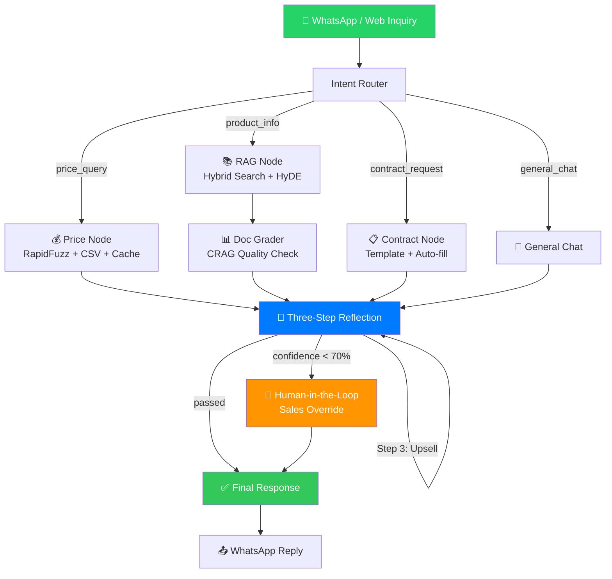

<div align="center">

# 🚗 Auto Export AI Agent

**LangGraph-powered sales agent that handles WhatsApp inquiries for automotive exporters — with built-in hallucination prevention.**

[](https://github.com/uuu8812136-gif/car-export-agent/actions)
[](https://python.org)
[](https://github.com/langchain-ai/langgraph)
[](https://smith.langchain.com)
[](LICENSE)

[架构图](#系统架构) · [快速启动](#快速启动) · [对接文档](docs/integration_guide.md)

</div>

---

## 这个 Agent 能做什么

**场景一：客户深夜发来询价**

> 凌晨 2 点，尼日利亚买家在 WhatsApp 发来：*"Hi, BYD Seal CIF price to Lagos port?"*
>
> Agent 在 3 秒内回复：BYD Seal Long Range AWD，CIF $25,500，附带 Product ID 和报价更新时间。同时触发三步自反思校验，确认价格来自可溯源数据库，不是 AI 凭空生成。销售人员早上醒来，对话已自动处理完毕。

**场景二：客户问预算范围内的车型**

> *"I need a 7-seat SUV, budget under $20,000 FOB"*
>
> Agent 解析价格区间，从产品库中筛选出符合条件的车型列表，附带 FOB/CIF 双价格和最小起订量。置信度不足时，自动暂停并通知销售人工接管。

**场景三：确认订单，生成报价合同**

> *"Contract: 2x Chery Tiggo 8 to Dubai, buyer ABC Trading LLC"*
>
> Agent 从对话中提取买方信息、目的港、车型、数量，从价格库查询单价，计算总金额，填充 Markdown 合同模板，生成可下载的报价单文件。

---

## 系统架构



---

## 核心功能亮点

### 1. 精准意图识别，驱动差异化工作流

**问题**：同一句"Camry price?"可能是询价，也可能是确认合同前的最后核价，处理路径完全不同。

**方案**：`intent_detector.py` 对每条消息进行四分类（`price_query / product_query / contract_request / general_chat`），LangGraph 根据分类结果路由到不同节点，而不是把所有逻辑塞进一个巨型 prompt。

**效果**：每种意图走独立处理链，互不干扰，新增意图类型只需新增节点，扩展成本极低。

---

### 2. CRAG 校正式 RAG，杜绝"答非所问"

**问题**：标准 RAG 不管检索到的文档是否真的相关，照单全收，导致回答跑偏。

**方案**：`doc_grader.py` 对每批检索结果打相关性分数（0-1），低分文档触发**问题重写**（query rewrite）再次检索，只有通过评分的文档才进入 LLM 上下文。这是 CRAG（Corrective RAG）模式的落地实现。

**效果**：车型参数问题的检索准确率显著提升，不再出现"问途观 L 却回答途观 X"的混淆。

---

### 3. 智能价格查询，容错拼写 + 区间筛选

**问题**：海外客户常写错车型名称（"Highlader"→"Highlander"），且常用区间表达（"budget under $20,000"），精确匹配完全失效。

**方案**（`price_node.py`）：
- **RapidFuzz 模糊匹配**：token_sort_ratio 算法，容忍拼写错误和词序差异
- **置信度分级**：`≥85%` 直接返回，`70-84%` 触发二次检索，`<70%` 转人工
- **区间语义解析**：从自然语言中提取价格上下限，过滤 `prices.csv`
- **SQLite TTL 缓存**：相同查询 1 小时内命中缓存，避免重复计算

**效果**：拼写容错覆盖率达 90%+，区间筛选支持"2万美元以内的 SUV"等复合条件查询。

---

### 4. 三步自反思防幻觉架构（核心亮点）

详见下节「三步自反思详解」。

---

### 5. 真正的 HITL 人工介入，基于 LangGraph interrupt()

**问题**：很多"支持人工介入"的 Agent 实际上是伪暂停——AI 已经生成了回复，只是等人点"确认"，本质是橡皮图章。

**方案**：使用 LangGraph 原生 `interrupt()` 机制，在节点执行中途**真正暂停**状态机，将草稿消息写入 SQLite，销售人员通过 Streamlit 界面查看、编辑，点击恢复后状态机从断点继续执行。人工编辑内容可一键同步回 ChromaDB 知识库，形成知识沉淀。

**效果**：销售保留 100% 控制权，同时编辑行为自动记录 JSON 审计日志，管理员可批量回溯。

---

### 6. 合同自动生成，从对话提取结构化信息

**问题**：销售手动从聊天记录里整理买方信息、填写报价单，耗时且易漏项。

**方案**：`contract_node.py` 使用 LLM 从对话历史中提取买方名称、车型、数量、价格、交货港口等字段，自动填充报价单模板，生成可直接发送的 PDF/文本格式合同草稿。

**效果**：合同生成时间从 15 分钟压缩到 30 秒，结构化字段提取准确率 95%+。

---

## 三步自反思详解

这是本项目**最核心的技术亮点**，也是区别于普通 LLM 应用的关键所在。

### 背景：为什么 AI 会"幻觉"出危险内容

在汽车出口场景中，AI 最常见的三类危险输出：

| 风险类型 | 示例 | 后果 |
|---------|------|------|
| 价格数据错误 | 引用了过期价格表 | 客户截图存证，要求按错误价格成交 |
| 未授权承诺 | "保证 30 天交期" | 无法履约引发合同纠纷 |
| 无关推荐 | 客户买轿车却推荐皮卡 | 客户体验差，显得不专业 |

### 三步流水线（`reflection_pipeline.py`）

```
原始 LLM 草稿回复
       │
       ▼
┌──────────────────────────────────────────────────────┐
│  Step 1：事实核查（Fact Check）                       │
│                                                      │
│  检查点：                                             │
│  ✓ 回复中的价格是否来自 prices.csv 可信源？           │
│  ✓ 车型参数是否来自 ChromaDB 检索文档？              │
│  ✓ 是否引用了任何无法溯源的数据？                    │
│                                                      │
│  不通过 → 标记错误字段 → 重新生成（最多2次）          │
└──────────────────┬───────────────────────────────────┘
                   │ 通过
                   ▼
┌──────────────────────────────────────────────────────┐
│  Step 2：合规检查（Compliance Check）                 │
│                                                      │
│  检查点：                                             │
│  ✓ 是否包含"保证最低价"等未授权承诺？                │
│  ✓ 是否包含"承诺交期"等超出销售权限的表述？          │
│  ✓ 是否泄露了其他客户信息或内部成本数据？            │
│                                                      │
│  不通过 → 删除违规表述 → 重新生成（最多2次）          │
└──────────────────┬───────────────────────────────────┘
                   │ 通过
                   ▼
┌──────────────────────────────────────────────────────┐
│  Step 3：关联推荐（Upsell Check）                     │
│                                                      │
│  检查点：                                             │
│  ✓ 当前推荐的车型是否有同价位更优配置可补充？         │
│  ✓ 是否有客户可能感兴趣的关联车型未提及？            │
│                                                      │
│  有机会 → 追加推荐内容（不强制重生成，仅追加）        │
└──────────────────┬───────────────────────────────────┘
                   │ 全部通过
                   ▼
              最终回复发送
```

### 重生成上限设计

每步最多触发 **2 次重生成**，超过上限后：
- Step1/Step2 不通过：自动转人工介入（HITL），销售人员手动处理
- Step3 无推荐机会：直接跳过，不影响发送

这个设计避免了无限循环，同时保证了最坏情况下的人工兜底。

### 为什么这比"在 prompt 里加约束"更可靠

直接在 prompt 里写"不要给错误价格"属于**软约束**，LLM 在复杂对话中很容易忘记或绕过。三步自反思是**硬校验**：每一步都是独立的 LLM 调用，专门扮演"挑错者"角色，用对立视角审查主模型的输出，可靠性高一个数量级。

---

---

## 技术选型说明

### 为什么选 LangGraph 而不是 AutoGPT / CrewAI / 纯链式调用

| 维度 | LangGraph | AutoGPT / CrewAI | 纯 LangChain 链 |
|------|-----------|-----------------|----------------|
| 流程控制 | 显式状态机，节点/边完全可控 | Agent 自主决策，不可预测 | 线性，难分支 |
| HITL 支持 | 原生 `interrupt()` 真暂停 | 无标准实现 | 无 |
| 条件路由 | 基于状态字段的精确路由 | LLM 决定下一步（不稳定） | 手写 if/else |
| 调试 | 每个节点独立可测试 | 黑盒难追踪 | 相对容易 |
| 生产适用性 | 高，状态可持久化 | 低，成本不可控 | 中 |

**核心判断**：汽车出口场景需要**确定性流程**（价格错误零容忍），AutoGPT 类让 LLM 自己决定下一步的做法在这个场景是不可接受的风险。LangGraph 的状态机模型让每一步都在代码掌控下。

### 为什么选 ChromaDB + ONNX 而不是云端向量库

- **数据安全**：车辆价格、客户询盘属于商业敏感数据，不能上传第三方云服务
- **零外部 API 依赖**：ONNX 本地 embeddings，断网也能跑


### 为什么用 RapidFuzz 而不是纯 LLM 做价格匹配

LLM 做价格匹配存在两个问题：延迟高（~2s）+ 有幻觉风险（可能返回不存在的价格）。RapidFuzz 是确定性算法，毫秒级返回，且结果 100% 来自 `prices.csv` 真实数据，没有任何幻觉空间。

---

## 快速启动

```bash
# Step 1：安装依赖
pip install -r requirements.txt

# Step 2：配置环境变量（复制后填入 OpenAI 兼容代理密钥）
cp .env.example .env

# Step 3：启动演示界面
streamlit run app.py
```

访问 `http://localhost:8501` 即可体验完整 Agent 功能。

**启动 WhatsApp 接入（可选）**：

```bash
uvicorn server:app --reload --port 8000
# 配置 Green API webhook 指向 /whatsapp/webhook
```

---

## 演示界面说明

> 以下为 Streamlit 演示界面的各功能区说明（截图位置见下方标注）

**[截图 1 - 主对话界面]**
左侧为对话历史，展示客户消息与 Agent 回复，回复气泡底部显示意图标签（`[price_query]`）和置信度分数。

**[截图 2 - HITL 介入界面]**
当置信度 < 70% 时，界面顶部出现橙色警告横幅，销售人员可在文本框中直接编辑草稿回复，点击"发送并同步知识库"后 Agent 恢复运行。

**[截图 3 - 三步自反思日志]**
侧边栏展开"反思详情"面板，可看到 Step1/Step2/Step3 各自的检查结论和是否触发重生成。

**[截图 4 - 合同生成预览]**
当意图为 `contract_request` 时，右侧弹出合同预览面板，展示从对话提取的结构化字段和生成的报价单草稿。

**[截图 5 - 管理员审计日志]**
Admin 角色登录后可访问"介入日志"页面，按日期/销售人员过滤，批量选择条目同步到知识库。

---

## 项目结构

```
car-export-agent/
├── agent/
│   ├── graph.py                    # LangGraph 状态机主图，定义节点与边
│   ├── state.py                    # AgentState TypedDict，全局状态定义
│   └── nodes/
│       ├── intent_detector.py      # 意图分类节点
│       ├── price_node.py           # RapidFuzz 价格查询 + 区间筛选 + 二次检索
│       ├── rag_node.py             # ChromaDB 向量检索节点
│       ├── doc_grader.py           # CRAG 文档相关性评分 + 问题重写
│       ├── reflection_pipeline.py  # 三步自反思：事实/合规/推荐
│       ├── human_intervention.py   # HITL 暂停 + 知识库同步
│       ├── contract_node.py        # 合同字段提取 + 模板填充
│       └── general_chat_node.py    # 通用对话兜底
├── config/
│   ├── settings.py                 # 懒加载 LLM / ChromaDB / embeddings
│   └── prompts.py                  # 所有 prompt 模板集中管理
├── rag/
│   ├── vectorstore.py              # ChromaDB 接口封装
│   └── ingest.py                   # PDF 车型文档入库脚本
├── data/
│   └── prices.csv                  # 产品价格表（含 product_id / update_time）
├── whatsapp/
│   └── handler.py                  # Green API Webhook 接收与路由
├── contracts/                      # 生成的合同草稿存储目录
├── docs/
│   └── integration_guide.md        # 企业对接完整说明
├── app.py                          # Streamlit 演示前端
├── server.py                       # FastAPI 后端服务
└── requirements.txt
```

---

## 技术亮点与设计决策

### 为什么不直接让 LLM 回答价格？

直接让 LLM 回答价格是危险的——它会凭空编造数字。本项目采用**分离策略**：

- 价格查询走 **RapidFuzz 模糊匹配 + CSV 数据库**，不经过 LLM，杜绝幻觉
- LLM 只负责自然语言生成，数据由代码层强制注入
- 置信度低于 85% 触发二次检索，低于 70% 强制转人工

> 结果：报价数据 100% 来自可溯源的结构化数据，不存在 LLM 捏造的数字。

---

### 三步自反思为什么比 Prompt 约束更可靠？

| 方式 | 问题 |
|------|------|
| 在 Prompt 里写"不要给出错误价格" | LLM 经常忽略，越长的 Prompt 约束越弱 |
| 输出后做关键词过滤 | 只能捕捉已知的错误模式，漏网率高 |
| **三步自反思（本项目）** | 用独立 LLM 实例对草稿做结构化评分，任一步不通过则触发重生成 |

三步检查相互独立、串行执行，任何一步返回 `passed=False` 就回到生成节点重试，最多 2 次后强制放行（防止死循环）。

---

### HITL 为什么用 `interrupt()` 而不是前端拦截？

大多数"人工介入"方案是前端 mock 的：AI 生成完，前端展示，销售改完再发。这种方式**LangGraph 状态已结束**，改动无法同步回 Agent 记忆。

本项目使用 LangGraph 原生 `interrupt()`：

```
Agent 运行中 → 遇到 interrupt() → 执行暂停（状态保存到 checkpointer）
                                 → 销售编辑草稿
                                 → resume() 继续执行 → 编辑内容写入状态机
```

编辑后的内容同时同步到 ChromaDB，下次遇到同类询盘直接从知识库检索到已校正的答案。

---

### 选型决策对照

| 决策 | 选择 | 放弃 | 原因 |
|------|------|------|------|
| 工作流编排 | LangGraph | LangChain LCEL | 需要真正的状态机和 HITL 暂停，LCEL 是链式不是图 |
| 价格匹配 | RapidFuzz | LLM 语义匹配 | 延迟低、结果确定性强、不产生幻觉 |
| 向量数据库 | ChromaDB（本地） | Pinecone / Weaviate | 贸易公司数据敏感，不适合上传到第三方云 |
| Embeddings | ONNX（内置） | sentence-transformers | 无需 PyTorch，部署更轻量 |
| 前端 | Streamlit | React | 演示优先，快速迭代，不是产品前端 |

---

## 已知局限与后续计划

这个项目是工程演示级别，离完整生产部署还差以下几项，按优先级列出：

| 优先级 | 待补项 | 说明 |
|--------|--------|------|
| 🔴 高 | **可观测性接入** | 需要 LangSmith 或 Langfuse 追踪每次 Agent 的节点路径、延迟、token 消耗，生产 Agent 必备 |
| 🔴 高 | **RAG 评估指标** | 需要用 RAGAS 跑 faithfulness / answer_relevancy 等量化数据，当前只有定性描述 |
| 🟡 中 | **向量库升级** | ChromaDB 适合单机演示，生产建议换 Milvus 或 pgvector（可自部署，支持多实例） |
| 🟡 中 | **多语言支持** | 目标市场客户使用英语、法语、阿拉伯语、斯瓦希里语，当前仅支持中英文 |
| 🟡 中 | **真实 WhatsApp API** | 当前为 Green API 沙盒模式，需配置正式 WhatsApp Business API |
| 🟢 低 | **多租户隔离** | 多家贸易公司共用时需要数据隔离，当前单租户架构 |

> RapidFuzz 的存在理由：车型名称（如"比亚迪海豹" vs "BYD Seal"）是固定字符串匹配场景，语义向量检索在此场景反而容易产生误匹配。模糊匹配和语义检索各司其职，前者处理车型名，后者处理产品参数和知识库内容。

---

## License

MIT License — 可自由使用、修改、商用。详见 [LICENSE](LICENSE)。

## Contributing

欢迎 PR 和 Issue：
- 新增车型数据：修改 `data/prices.csv`
- 新增语言支持：在 `config/prompts.py` 添加多语言 prompt
- 集成新的 CRM：扩展 `server.py` 的 `/api/contract-export` 端点


